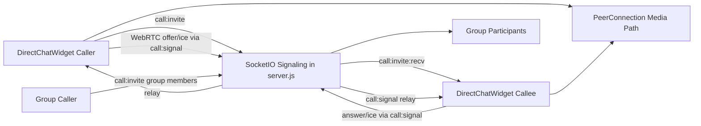

# Phase 1 WebRTC Calls (1-1 + Group)

## Scope
- Implement call MVP inside existing internal chat: direct call and group call.
- Features in phase 1: start call, incoming ring dialog, accept/reject, audio/video stream, participant join/leave, end call.
- Reuse current JWT/session auth and existing Socket.IO connection.

## Architecture

## Backend changes
- Extend Socket.IO handlers in [C:\Users\ldakv\OneDrive\Business\Coding\Digital Notary Office\backend\server.js](C:\Users\ldakv\OneDrive\Business\Coding\Digital Notary Office\backend\server.js):
  - Add `call:invite`, `call:accept`, `call:reject`, `call:end`, `call:signal`.
  - Reuse `emitToUser` for direct routing and existing group membership checks for group calls.
  - Add lightweight in-memory call session map keyed by `callId` for phase 1 state transitions (`ringing`, `active`, `ended`).
- Add TURN/STUN env plumbing (read-only config in code): `VITE_WEBRTC_ICE_SERVERS` on frontend and mirrored server-side validation if needed.
- Add guardrails:
  - Reject invite if target user not authorized (not in group / invalid user).
  - Idempotent end/reject handling to prevent duplicate events.

## Frontend changes
- Update [C:\Users\ldakv\OneDrive\Business\Coding\Digital Notary Office\frontend\src\DirectChatWidget.jsx](C:\Users\ldakv\OneDrive\Business\Coding\Digital Notary Office\frontend\src\DirectChatWidget.jsx):
  - Add call state machine (`idle`, `outgoing`, `incoming`, `connecting`, `inCall`).
  - Add call actions in header/menu (direct + group).
  - Add incoming call dialog and in-call panel (local/remote video, mute camera/mic, hang up).
  - Hook new socket events and WebRTC peer connection lifecycle.
- Keep auth token consistency with existing flow in [C:\Users\ldakv\OneDrive\Business\Coding\Digital Notary Office\frontend\src\App.jsx](C:\Users\ldakv\OneDrive\Business\Coding\Digital Notary Office\frontend\src\App.jsx):
  - Reuse existing token lifecycle and reconnect socket when needed.
- Add translation keys in [C:\Users\ldakv\OneDrive\Business\Coding\Digital Notary Office\frontend\src\i18n.jsx](C:\Users\ldakv\OneDrive\Business\Coding\Digital Notary Office\frontend\src\i18n.jsx) for call UI/actions/errors.

## Data/event contract (MVP)
- `call:invite` payload: `{ callId, mode, toUserId?, groupId?, media }`
- `call:invite:recv` payload: `{ callId, fromUser, mode, groupId?, media }`
- `call:accept|call:reject|call:end`: `{ callId, reason? }`
- `call:signal`: `{ callId, toUserId, signal: { type, sdp?, candidate? } }`

## Validation and test plan
- Direct call: caller invite -> callee accept/reject -> media connects -> both can hang up.
- Group call: only group members receive invite; non-members blocked.
- Permission/device: deny mic/camera permission shows localized error and safe fallback.
- Reconnect basics: if socket disconnects during call, show call ended/reconnecting state.
- Browser sanity: test at least Chrome + Edge on local network with TURN disabled (same LAN), then with TURN enabled (cross-network).