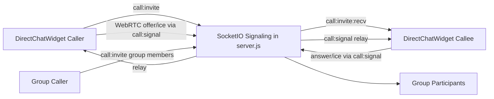

# Phase 1 WebRTC Calls (1-1 + Group)

## Scope
- Implement call MVP inside **internal chat (DirectChatWidget)**: direct call and group call.
- Features in phase 1: start call, incoming ring dialog, accept/reject, audio/video stream, participant join/leave, end call.
- Reuse **JWT + session** validation already on Socket.IO (`io.use` → `socket.data.user = { id, username }`).
- Reuse **`emitToUser(userId, event, payload)`** (routing by **numeric `user.id`**, same as chat messages).

## Compatibility with existing chat (rà soát)

| Thành phần | Ghi chú |
|-------------|---------|
| **Socket.IO** | Cùng một `io` connection và middleware JWT; thêm event prefix `call:*` để **không đụng** namespace `chat:*`. |
| **`emitToUser`** | Đã nhận `userId` (number). Payload tín hiệu dùng `toUserId` (number) khớp Prisma `User.id`. |
| **`DirectChatWidget.jsx`** | Nơi đặt state machine + `RTCPeerConnection` + UI; đã có `socketRef`, `API_BASE`, `currentUser`. |
| **`ChatPopout.jsx`** | Chỉ bọc `DirectChatWidget` + token; **call UI phải chạy được** khi `isPopout` (layout fullscreen). |
| **`InternalChat.jsx`** | Kênh `/chat/messages` **legacy**, **không Socket.IO nhóm nội bộ** — **ngoài phạm vi Phase 1** (không thêm gọi video ở đây trừ khi có yêu cầu riêng). |
| **`App.jsx`** | Giữ nguyên vòng đời token; không cần đổi trừ khi tách socket (không khuyến nghị). |

## Delivery order (giảm rủi ro)
1. **1-1 signaling + WebRTC end-to-end** trước (2 peer, relay SDP/ICE qua server).
2. **Group**: mesh qua cùng `call:signal` với `toUserId`; **giới hạn số peer MVP** (ví dụ tối đa **6** người trong cuộc, hoặc chỉ mời “đang online” theo `userSocketIds`) để tránh bão tín hiệu — ghi rõ trong UI. SFU (mediasoup/LiveKit) để **phase sau** nếu nhóm lớn.

## Architecture

## Backend changes
- Extend Socket.IO handlers in `backend/server.js` **inside** existing `io.on("connection", (socket) => { ... })` (sau `chat:presence:ping`, trước khi đóng callback nếu có chỗ hợp lý — hoặc ngay trước `disconnect` listener nếu cấu trúc file yêu cầu).
- Events: `call:invite`, `call:accept`, `call:reject`, `call:end`, `call:signal`.
- In-memory `Map` theo `callId`: `{ state, mode, callerId, participantIds:Set, groupId?, createdAt }` — Phase 1 không persist DB.
- **Direct**: chỉ `emitToUser(targetUserId, ...)` khi invite/signal; kiểm tra `targetUserId !== actor.id`.
- **Group**: `prisma.groupChatMember.findMany({ where: { groupId } })` → chỉ emit tới `userId` là member; caller phải là member.
- **Disconnect**: khi `socket.on("disconnect")` đã có — bổ sung: nếu user đang trong `call` active/ringing, gọi logic `leaveCallOrEnd` và `emitToUser` cho các peer còn lại `call:end` hoặc `call:peer-left`.
- **TURN/STUN**: frontend đọc env (xem dưới); server không bắt buộc mirror ICE trừ khi sau này server tạo token TURN.

## Frontend changes
- `frontend/src/DirectChatWidget.jsx`:
  - State machine `idle | outgoing | incoming | connecting | inCall | ended`.
  - Nút gọi trong header vùng chat (direct: peer đã chọn; group: nhóm đã chọn).
  - Dialog cuộc đến + panel in-call (local/remote video, mute mic/cam, hangup).
  - `socket.on('call:...')` + tạo `RTCPeerConnection` với `iceServers` từ env.
- `frontend/src/ChatPopout.jsx`: không đổi logic auth; chỉ kiểm tra UI call không bị `overflow:hidden` che.
- `frontend/src/i18n.jsx`: thêm khóa cho nút/gọi/lỗi/quyền.

## ICE / env (MVP)
- `VITE_WEBRTC_ICE_SERVERS`: chuỗi **JSON** mảng `RTCIceServer[]`, ví dụ:
  - `[{"urls":"stun:stun.l.google.com:19302"}]`
  - Khi có TURN: thêm object có `urls`, `username`, `credential`.
- Parse an toàn trong widget; nếu sai định dạng → fallback chỉ Google STUN.

## Data/event contract (MVP)
- `call:invite` (client → server): `{ callId, mode: 'direct'|'group', targetUserId?: number, groupId?: number, media?: { audio: boolean, video: boolean } }`  
  - **Direct**: bắt buộc `targetUserId`. **Group**: bắt buộc `groupId`, không dùng `targetUserId` (server mời toàn bộ member trừ caller).
- `call:invite:recv` (server → client): `{ callId, fromUser: { id, username }, mode, groupId?, media }`
- `call:accept` | `call:reject` | `call:end`: `{ callId, reason?: string }`
- `call:accepted` (server → client): `{ callId, acceptedBy, participantIds: number[], answeredIds: number[], mode, groupId? }` — chỉ thiết lập WebRTC khi `answeredIds` có `user.id` của client (người chưa accept nhóm vẫn thấy dialog, không bị ép vào mesh).
- `call:signal` (client → server): `{ callId, toUserId: number, signal: { type: 'offer'|'answer'|'ice-candidate', sdp?: string, candidate?: object } }`  
  - Server chỉ relay nếu `actor.id` và `toUserId` **cùng** tham gia `callId`.

## Validation and test plan
- Direct: invite → accept/reject → media → hangup; từ chối quyền mic/cam → thông báo i18n.
- Group: non-member không nhận invite; giới hạn peer MVP.
- Socket drop giữa chừng: cleanup session + UI `ended` / thông báo.
- Chrome + Edge; LAN không TURN rồi bật TURN nếu có.
